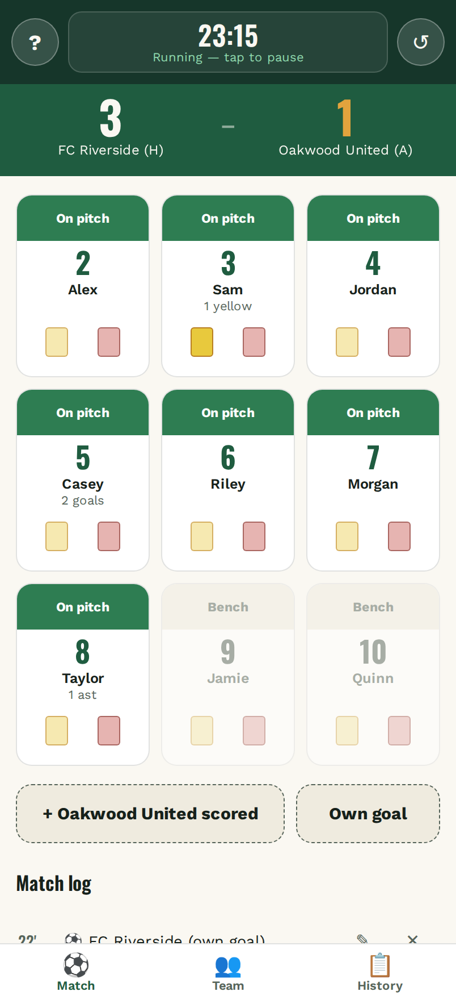
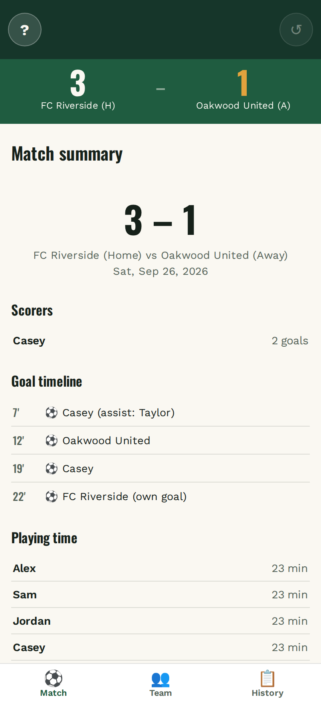
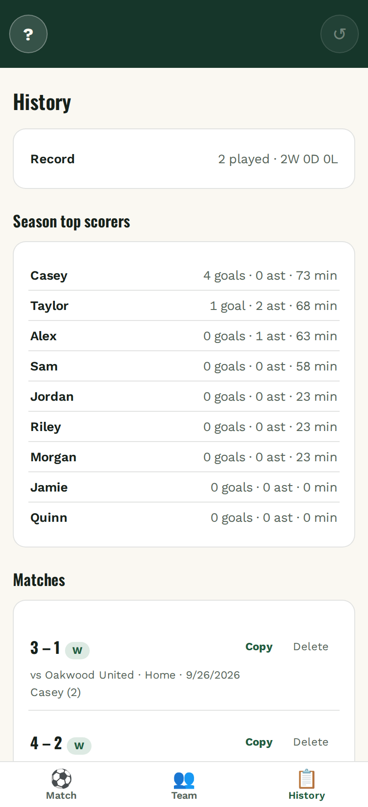
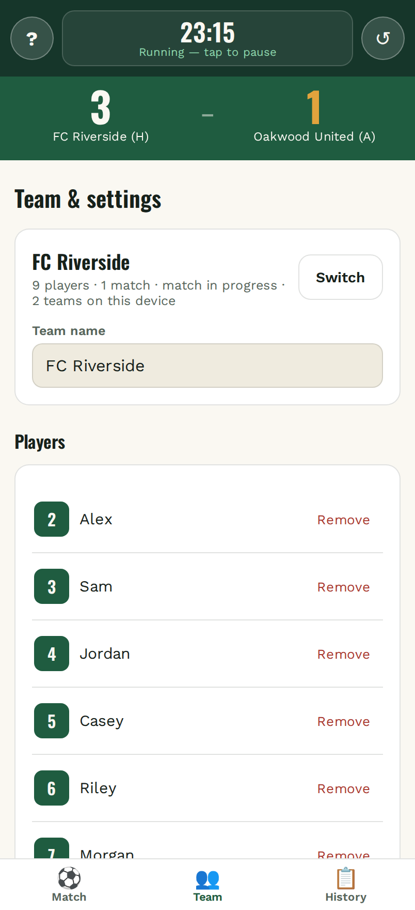
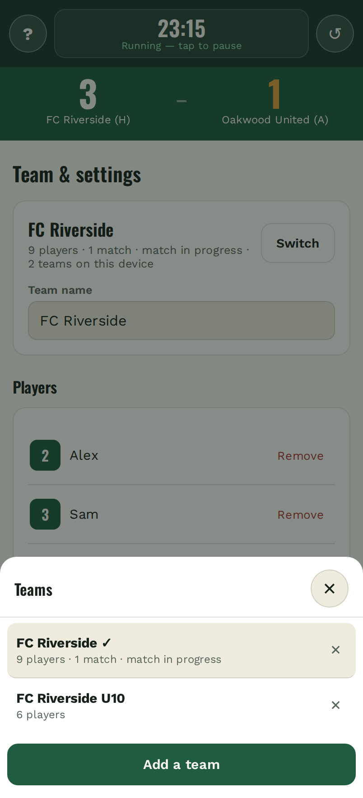
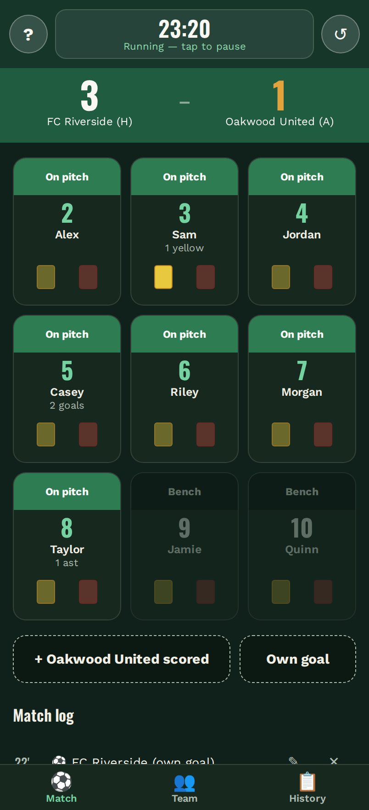

# Matchday Tracker

A simple, offline-first score tracker for youth soccer matches — built for tracking a game
one-handed from the sideline. No backend, no accounts, no build step: one HTML file.

## Screenshots

<table>
  <tr>
    <td align="center" width="33%">
      <br>
      <sub><b>Live match</b> — tap a player to score</sub>
    </td>
    <td align="center" width="33%">
      <br>
      <sub><b>Match summary</b> — shareable report</sub>
    </td>
    <td align="center" width="33%">
      <br>
      <sub><b>History</b> — season top scorers</sub>
    </td>
  </tr>
  <tr>
    <td align="center">
      <br>
      <sub><b>Team &amp; settings</b> — roster and options</sub>
    </td>
    <td align="center">
      <br>
      <sub><b>Multiple teams</b> — each fully separate</sub>
    </td>
    <td align="center">
      <br>
      <sub><b>Dark mode</b> — follows the system theme</sub>
    </td>
  </tr>
</table>

<sub>Screenshots use demo data, not a real roster.</sub>

## Features

**During the match**
- Tap a player's tile to log a goal — the score updates instantly
- Optional assists, yellow/red cards and playing time, all off by default
- On pitch / bench per player, so a benched player can't be tapped by mistake
- Own goals for either team, never credited to a player
- Running clock that keeps counting while the phone is locked
- Undo, plus edit and delete on every entry in the match log

**Rules it enforces so you don't have to**
- A second yellow automatically becomes a red
- A red card benches the player for the rest of the match
- Nothing can be logged before the clock is started, so every minute is accurate

**After the match**
- Summary with the score, goals per player and a minute-by-minute timeline
- One tap to copy a match report, ready to paste into a group chat
- Season history with top scorers, re-shareable per match

**Teams and sharing**
- Several teams on one device, each with its own roster, settings, history and match in progress
- Export a team to a JSON file; another parent or coach imports it without retyping the roster
- Importing adds a team — it never overwrites the teams already on the device

**On the phone**
- Installs to the home screen and runs fullscreen
- Works with no signal at the pitch
- Light and dark mode

## Deploying to GitHub Pages

Put these files in the repo root:

```
index.html
manifest.json
sw.js
icon-192.png
icon-512.png
icon-maskable-512.png
apple-touch-icon.png
screenshots/          (only needed for this README)
```

Then: **Settings → Pages → Deploy from a branch → main → /root**.

All paths are relative, so it works from a project URL
(`https://<user>.github.io/<repo>/`) without changes.

### Install it on a phone

Open the live URL, then **Share → Add to Home Screen** (iOS) or
**⋮ → Add to Home screen** (Android). It then opens fullscreen and works offline.

## Updating

After deploying a new `index.html`, bump `CACHE_VERSION` in `sw.js`
(e.g. `matchday-v6` → `matchday-v7`). Without this, devices that already
installed the app keep serving the cached version.

## Data

Everything is stored in the browser's local storage, on that device only —
nothing is sent anywhere. Use **Export team data** to share a roster and history
with someone else, who loads it with **Import team data**.

Because storage is per device and per browser, clearing site data or switching
browsers loses the history. Export a backup at the end of the season.
