<p align="center">
  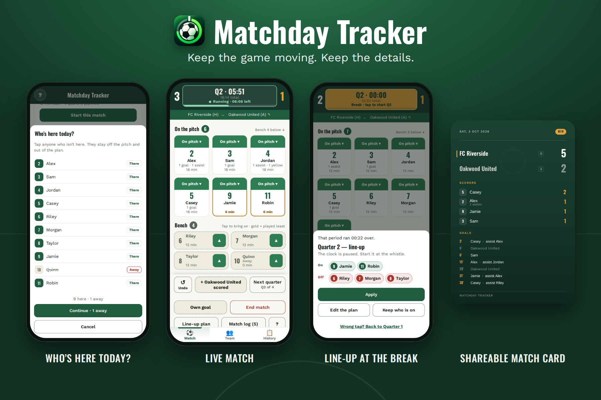
</p>

<p align="center">
  🚀 <a href="https://creativeacer.github.io/matchday-tracker/"><b>Open the live app</b></a>
  &nbsp;·&nbsp; no account, no install, works offline
</p>
<p align="center">
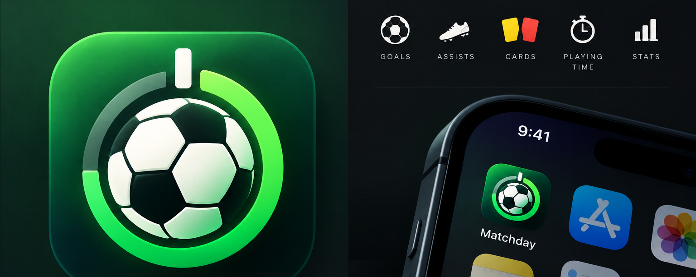
</p>

## 🎬 See it in action

<table>
  <tr>
    <td align="center" width="330" valign="top">
      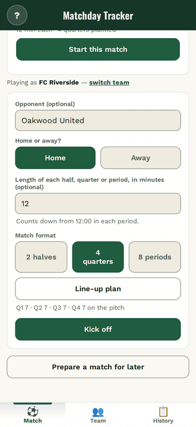
    </td>
    <td valign="middle">
      <b>A whole kick-off in twenty seconds</b>
      <ol>
        <li>Fill in the opponent, home or away and the match format.</li>
        <li><b>Who's here today?</b> Tap the kid who didn't make it. They stay off the pitch and out of the plan.</li>
        <li>Start the clock. It keeps counting while the phone is locked.</li>
        <li>Tap a player's tile for a goal, then tap who assisted.</li>
        <li>Opponent scored? One button.</li>
        <li><b>Time's up</b> turns the clock gold. Tap <i>Next quarter</i> and the app proposes who comes on and who goes off.</li>
      </ol>
    </td>
  </tr>
</table>

## ⭐ Key features at a glance

<table>
  <tr>
    <td width="33%" valign="top">
      <b>⚽ One tap per goal</b><br>
      Tap the scorer's tile, then the assist. The score, the scorers and the timeline follow on their own.
    </td>
    <td width="33%" valign="top">
      <b>⏱️ Fair playing time</b><br>
      Live minutes on every tile. The player with the least time is outlined in gold, so the bench is never forgotten.
    </td>
    <td width="33%" valign="top">
      <b>📋 Line-up plan</b><br>
      Plan who plays each half, quarter or short period. <i>Spread evenly</i> shares the minutes out for you.
    </td>
  </tr>
  <tr>
    <td valign="top">
      <b>🟨 Cards, with the rules built in</b><br>
      A second yellow becomes a red. A red benches the player for the rest of the match.
    </td>
    <td valign="top">
      <b>🖼️ Shareable match card</b><br>
      The result as a picture: score, scorers with shirt numbers and the minute of every goal. Ready for the parents' group chat.
    </td>
    <td valign="top">
      <b>📈 Season history</b><br>
      Every match, the record and the top scorers. Fix a finished match and the totals recalculate.
    </td>
  </tr>
</table>

## 📸 A matchday, step by step

### Before the match

<table>
  <tr>
    <td align="center" width="25%" valign="top">
      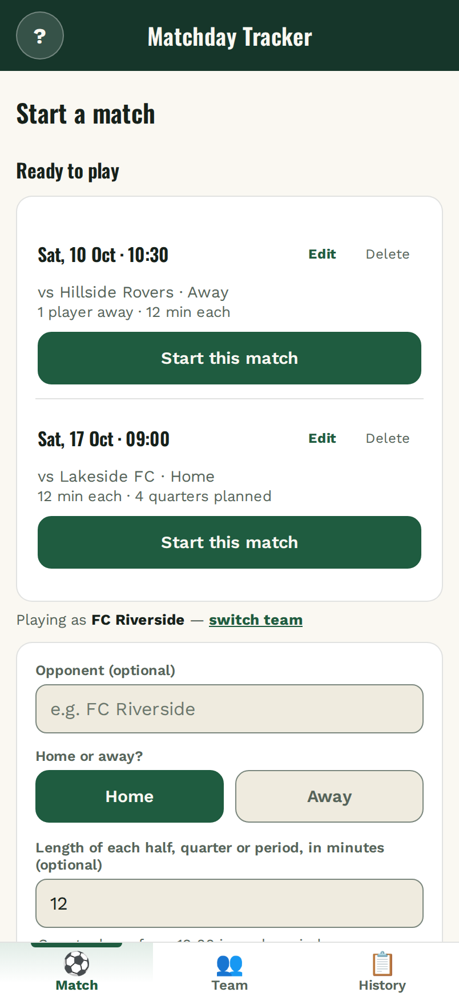<br>
      <sub><b>Ready to play</b><br>Matches prepared days ahead, earliest first</sub>
    </td>
    <td align="center" width="25%" valign="top">
      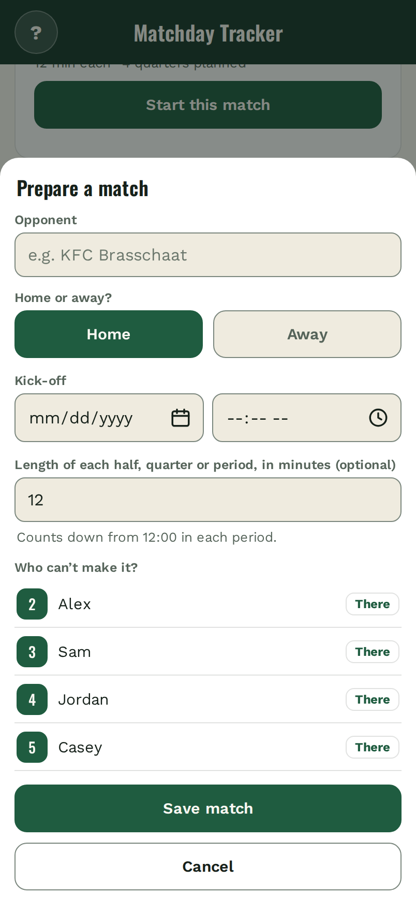<br>
      <sub><b>Prepare a match</b><br>Opponent, kick-off and who can't make it</sub>
    </td>
    <td align="center" width="25%" valign="top">
      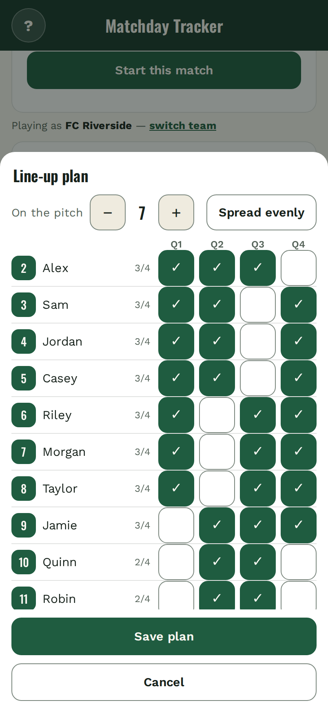<br>
      <sub><b>Line-up plan</b><br>Who plays which quarter, spread evenly in one tap</sub>
    </td>
    <td align="center" width="25%" valign="top">
      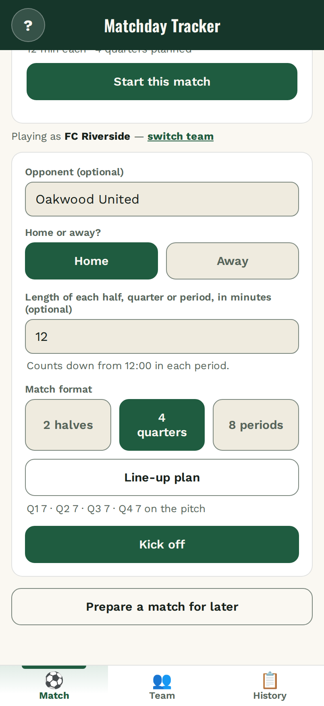<br>
      <sub><b>Kick off</b><br>2 halves, 4 quarters or 8 short periods</sub>
    </td>
  </tr>
</table>

### During the match

<table>
  <tr>
    <td align="center" width="25%" valign="top">
      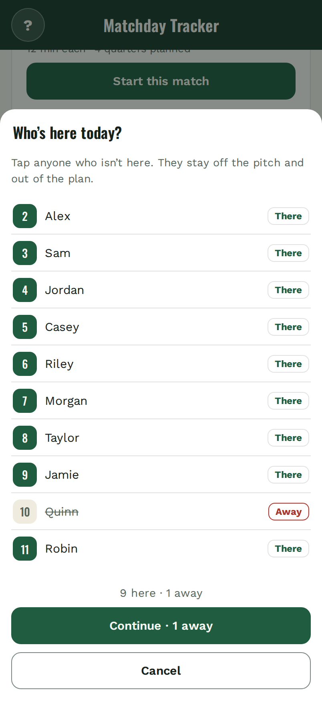<br>
      <sub><b>Who's here today?</b><br>Absent players stay off the pitch and out of the plan</sub>
    </td>
    <td align="center" width="25%" valign="top">
      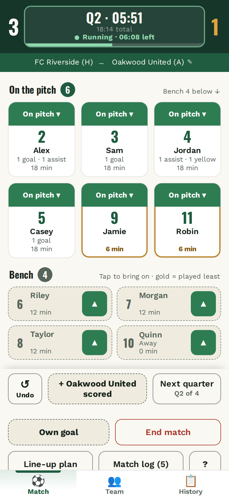<br>
      <sub><b>Live match</b><br>Clock, score, minutes per player and the bench</sub>
    </td>
    <td align="center" width="25%" valign="top">
      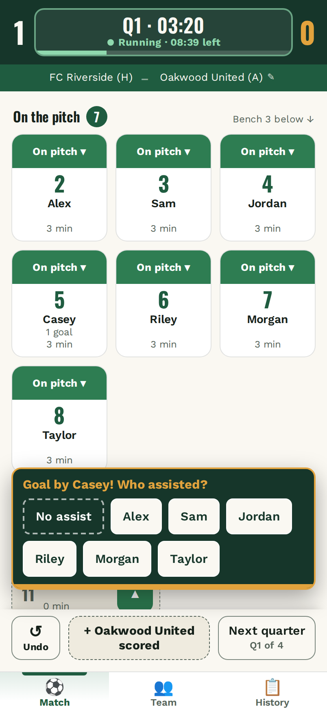<br>
      <sub><b>Goal and assist</b><br>One tap on the scorer, one on the assist</sub>
    </td>
    <td align="center" width="25%" valign="top">
      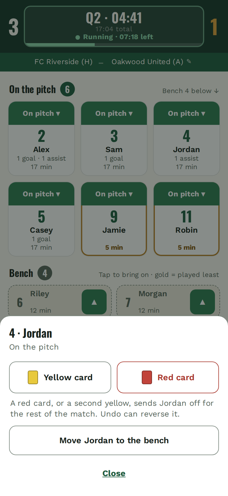<br>
      <sub><b>Cards and bench</b><br>Yellow, red, or send a player to the bench</sub>
    </td>
  </tr>
</table>

### Mistakes, breaks and the final whistle

<table>
  <tr>
    <td align="center" width="25%" valign="top">
      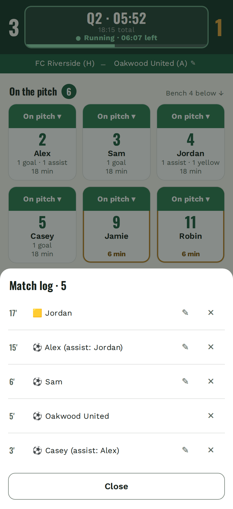<br>
      <sub><b>Match log</b><br>Edit or delete any entry, the score follows</sub>
    </td>
    <td align="center" width="25%" valign="top">
      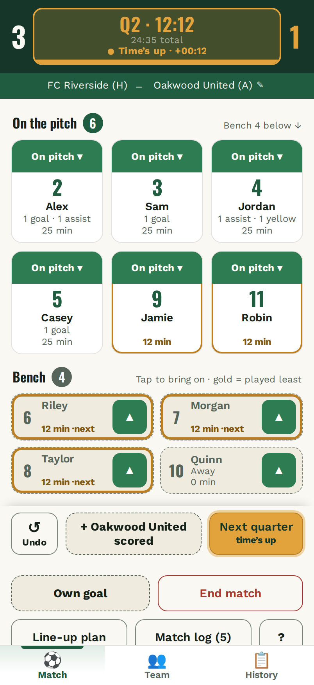<br>
      <sub><b>Time's up</b><br>The clock turns gold once the period is over</sub>
    </td>
    <td align="center" width="25%" valign="top">
      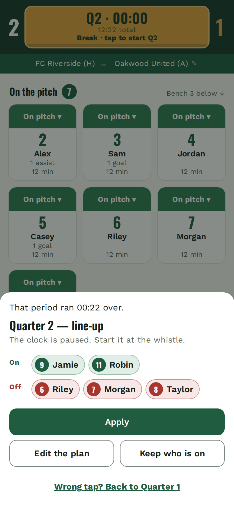<br>
      <sub><b>Line-up at the break</b><br>Who comes on, who goes off, one tap to apply</sub>
    </td>
    <td align="center" width="25%" valign="top">
      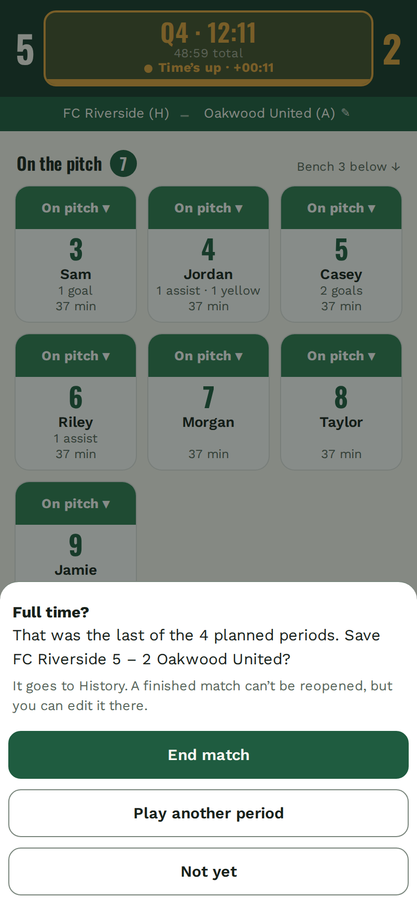<br>
      <sub><b>Full time</b><br>Save to History, play on, or not yet</sub>
    </td>
  </tr>
</table>

### After the match

<table>
  <tr>
    <td align="center" width="25%" valign="top">
      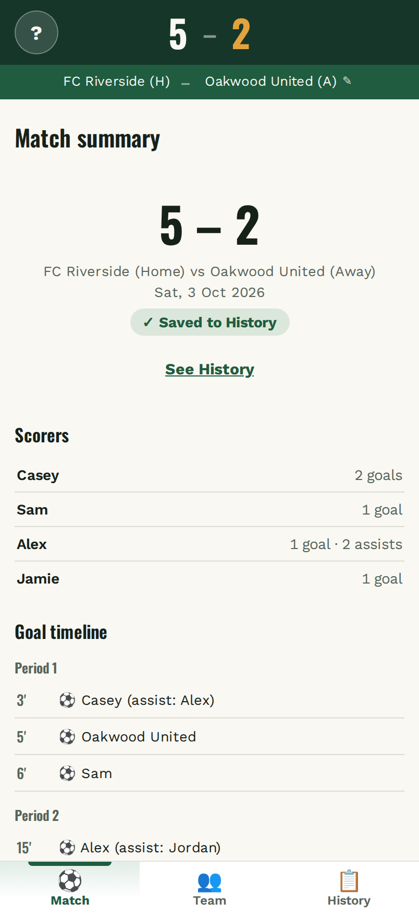<br>
      <sub><b>Match summary</b><br>Score, scorers and a timeline per period</sub>
    </td>
    <td align="center" width="25%" valign="top">
      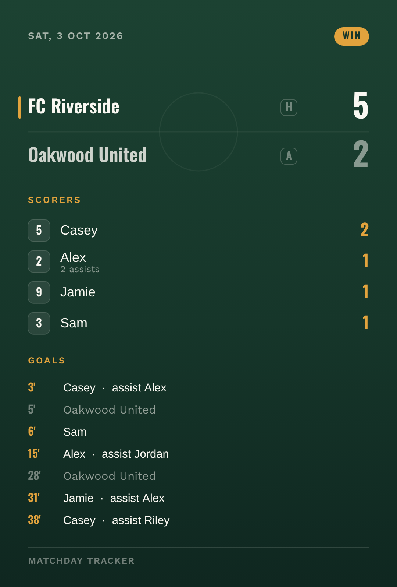<br>
      <sub><b>Match card</b><br>A picture to share, goal minutes optional</sub>
    </td>
    <td align="center" width="25%" valign="top">
      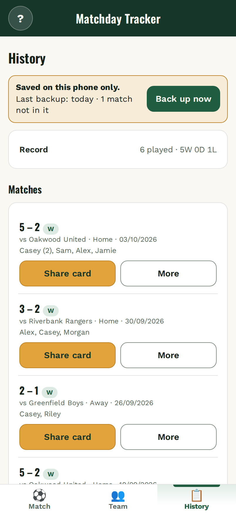<br>
      <sub><b>History</b><br>The season record, every match re-shareable</sub>
    </td>
    <td align="center" width="25%" valign="top">
      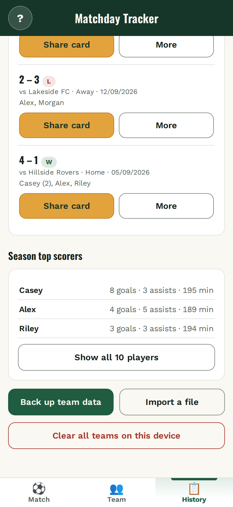<br>
      <sub><b>Top scorers</b><br>Goals, assists and minutes for the season</sub>
    </td>
  </tr>
</table>

### Teams, options and backup

<table>
  <tr>
    <td align="center" width="25%" valign="top">
      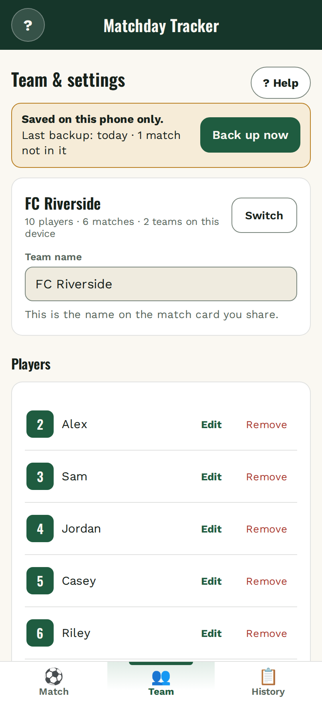<br>
      <sub><b>Team &amp; roster</b><br>Set up once, used for every match</sub>
    </td>
    <td align="center" width="25%" valign="top">
      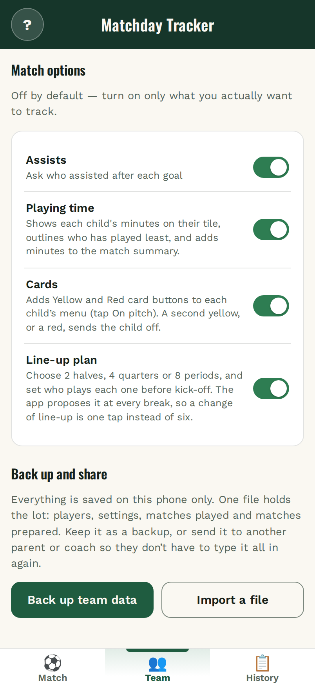<br>
      <sub><b>Match options</b><br>Off by default. Switch on only what you track</sub>
    </td>
    <td align="center" width="25%" valign="top">
      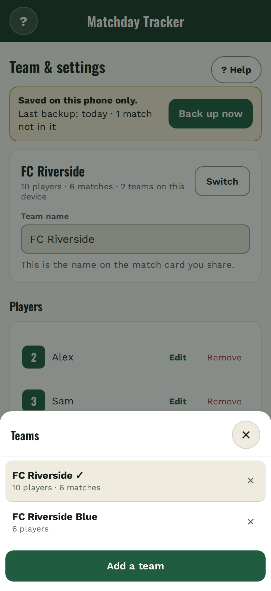<br>
      <sub><b>Several teams</b><br>Each with its own roster, history and match</sub>
    </td>
    <td align="center" width="25%" valign="top">
      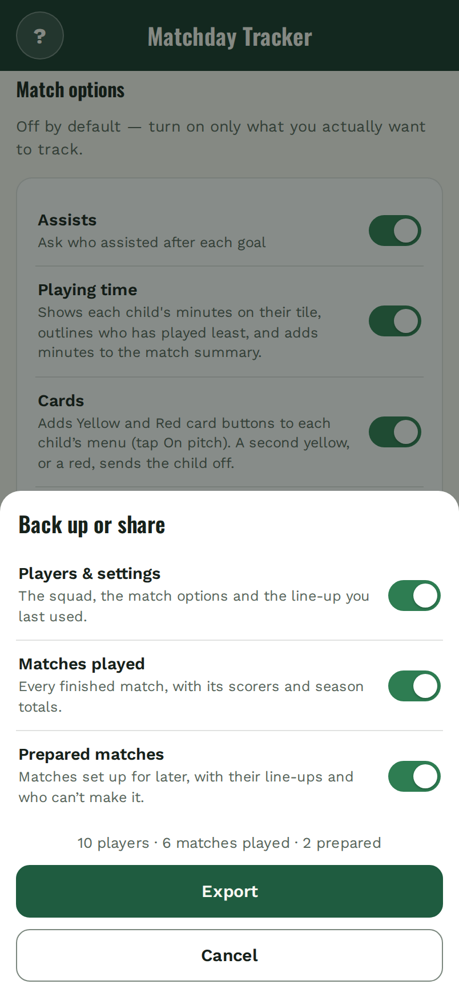<br>
      <sub><b>Back up or share</b><br>One file holds the lot, to restore or hand over</sub>
    </td>
  </tr>
</table>

### 🌙 Dark mode

Follows the phone's theme, so it stays easy on the eyes on an evening pitch.

<table>
  <tr>
    <td align="center" width="33%" valign="top">
      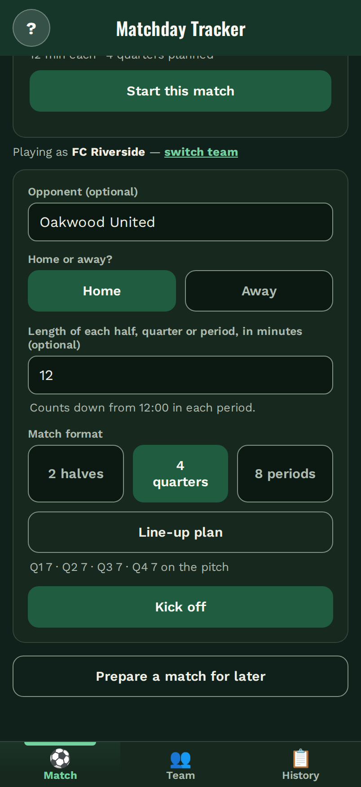<br>
      <sub><b>Kick off</b></sub>
    </td>
    <td align="center" width="33%" valign="top">
      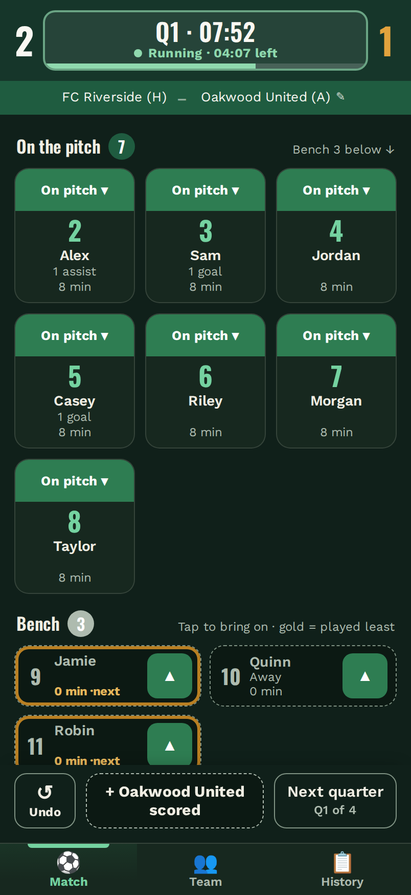<br>
      <sub><b>Live match</b></sub>
    </td>
    <td align="center" width="33%" valign="top">
      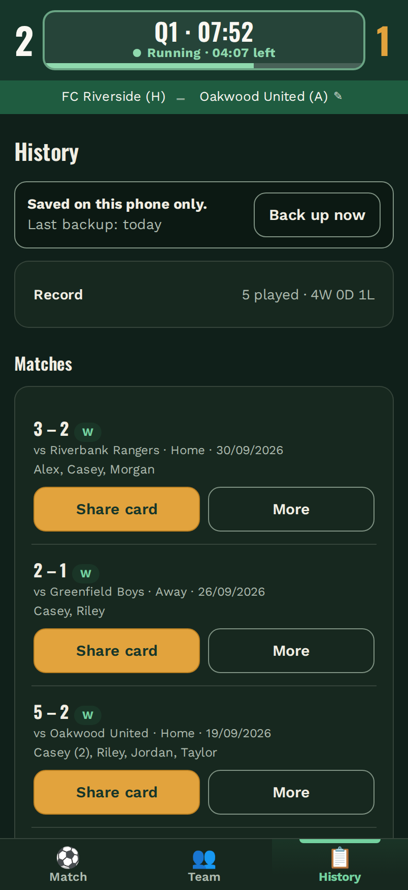<br>
      <sub><b>History</b></sub>
    </td>
  </tr>
</table>

<sub>All screenshots use fictional demo data (FC Riverside), not a real roster.</sub>
 
## 🧩 Everything it does

The tour above shows the flow. Open a block for the full list.

<details>
<summary><b>📅 Before the match</b> &nbsp;·&nbsp; prepare days ahead, plan the minutes</summary>

- Prepare a match days ahead: opponent, home or away, kick-off date and time, who can't make it
- Saved matches wait under **Ready to play**, earliest first, and start with one tap
- **Line-up plan**: set who plays each period (2 halves, 4 quarters or 8 short periods); **Spread evenly** shares the minutes out
- **Who's here today?** at kick-off: absent players stay off the pitch and out of the plan
- The line-up you started with is reused next match, so the bench is set once

</details>

<details>
<summary><b>⚽ During the match</b> &nbsp;·&nbsp; goals, assists, cards, minutes</summary>

- Tap a player's tile to log a goal, the score updates instantly
- Optional assists, yellow/red cards and playing time, all off by default
- The planned line-up is applied at kick-off and proposed at every break, listing who comes on and off
- On pitch / bench per player, so a benched player can't be tapped by mistake
- Live minutes on every tile, with the least-played player outlined in gold
- Own goals for either team, never credited to a player
- Running clock that keeps counting while the phone is locked
- A clock for the whole game, with the current period shown separately (**Q2 · 01:20**)
- Optional period length: the clock turns gold once the referee plays past it
- Half-time button that pauses the clock and starts a new period
- Undo, plus edit and delete on every entry in the match log, which opens in its own screen so the match screen never grows
- Correct the opponent's name mid-match if you mistyped it

</details>

<details>
<summary><b>🟨 Rules it enforces</b> &nbsp;·&nbsp; so you don't have to</summary>

- A second yellow automatically becomes a red
- A red card benches the player for the rest of the match
- Nothing can be logged before the clock is started, so every minute is accurate

</details>

<details>
<summary><b>📋 After the match</b> &nbsp;·&nbsp; report, card, season</summary>

- **Match card**: the result as a shareable picture with the score, scorers with shirt numbers and every goal's minute
- Summary with the score, goals per player and a minute-by-minute timeline, grouped by period
- Share the report as text instead, or copy it
- Season history with top scorers, re-shareable per match as a card or as text
- **Fix** any finished match: edit or delete entries and the score, scorers and season totals are recalculated

</details>

<details>
<summary><b>👥 Teams and backup</b> &nbsp;·&nbsp; several teams, one file to restore or share</summary>

- Several teams on one device, each with its own roster, settings, history and match in progress
- **Back up team data** writes one JSON file with players, settings, matches played **and matches prepared** (line-ups, period lengths and absentees), so one file restores the lot after a wipe
- Switch parts of it off to share: just the squad for a new coach, or just next week's line-up for another parent
- **Import a file** adds the data as a new team and leaves your other teams alone; replacing a team with the same name is an explicit choice
- A reminder appears when matches have been played, or preparation done, since your last backup

</details>

## 🏆 Built for the sideline

<table>
  <tr>
    <td width="25%" valign="top">
      <b>🚫 No accounts</b><br>
      No sign-up, no backend, no database. Open it and start tracking.
    </td>
    <td width="25%" valign="top">
      <b>📴 Works with no signal</b><br>
      Fully offline at the pitch, once it has been opened one time.
    </td>
    <td width="25%" valign="top">
      <b>📱 Installs like an app</b><br>
      Add it to the home screen and it opens fullscreen.
    </td>
    <td width="25%" valign="top">
      <b>🔒 Stays on your phone</b><br>
      Everything is stored on the device. You decide when to back up or share.
    </td>
  </tr>
</table>

It is a **single self-contained HTML file** with no build step, no framework and no dependencies beyond Google Fonts.

## 🛠️ Run locally

```bash
git clone https://github.com/CreativeAcer/matchday-tracker.git
cd matchday-tracker
```

Open `index.html` in a browser and you are running it. Offline mode and installing to the home screen need the page to be served over http(s), so for those use any static server:

```bash
python3 -m http.server 8080   # then open http://localhost:8080
```

## 💾 Your data and privacy

Team and match data is stored in your browser's **Local Storage**, on this device only. Nothing is sent anywhere.

- **Back up team data** (on the Team and History screens) writes everything to one JSON file.
- **Import a file** puts it back, or loads it on another phone to move or share a team.
- Clearing your browser data removes the app's data, so keep a backup. The app tells you when one is due.

## 🌐 Hosting

The app is a static site, so it runs almost anywhere: **GitHub Pages** (the live version), Netlify, Cloudflare Pages or any static web server.

## 📁 Project structure

```text
matchday-tracker/
├── index.html          # the whole app
├── sw.js               # service worker: offline support
├── manifest.json       # installable PWA
├── icon-*.png          # app icons
├── apple-touch-icon.png
├── screenshots/        # images used in this README
├── android-shell/      # Capacitor wrapper for an Android build
└── .github/workflows/  # Android build workflow
```

## 🤝 Contributing

Found a bug or have an idea for a useful matchday feature? Open an issue or submit a pull request.


